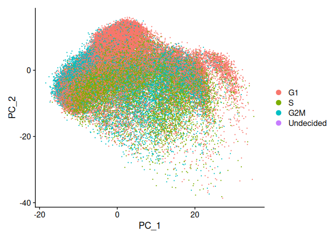
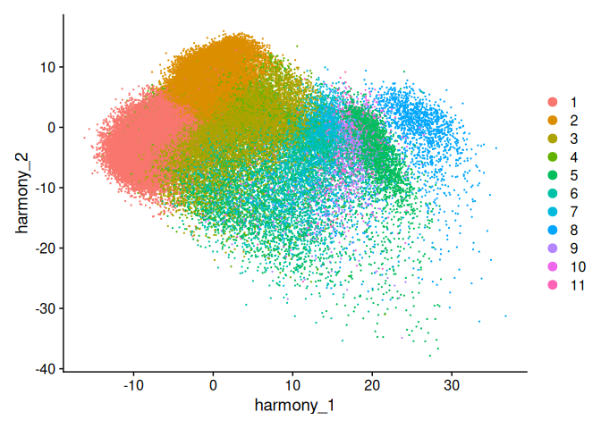
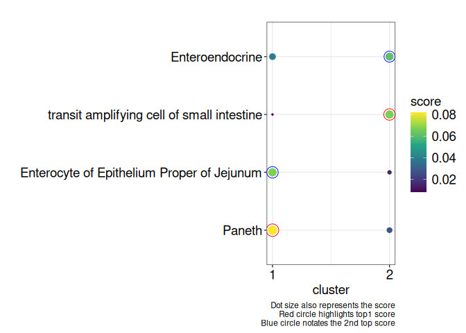
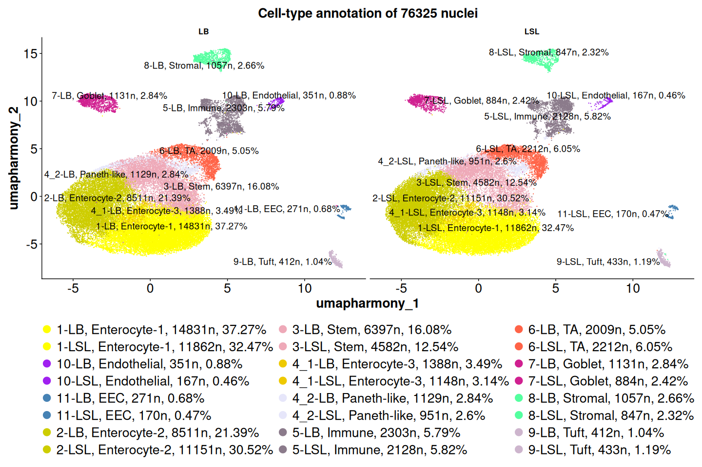

Single-cell RNA Seq Chicken Gut Downstream Analysis
================

- [Libraries](#libraries)
- [Helper functions](#helper-functions)
- [Meta data](#meta-data)
- [Load count matrices & create Seurat
  objects](#load-count-matrices--create-seurat-objects)
- [Empty drops removal](#empty-drops-removal)
- [Update gene symbols & preprocessing of low quality
  cells](#update-gene-symbols--preprocessing-of-low-quality-cells)
- [Doublets removal](#doublets-removal)
- [Mitochondrial and ribosomal
  contamination](#mitochondrial-and-ribosomal-contamination)
  - [Get mitochondrial genes](#get-mitochondrial-genes)
  - [Get mitochondrial genes per sample in each
    cell](#get-mitochondrial-genes-per-sample-in-each-cell)
  - [Percentage mitochondrial genes](#percentage-mitochondrial-genes)
  - [Percentage ribosomal genes](#percentage-ribosomal-genes)
  - [Filtering contaminated cells](#filtering-contaminated-cells)
- [Merge samples](#merge-samples)
- [sc-transformation](#sc-transformation)
- [Cell-cycle genes regressing out](#cell-cycle-genes-regressing-out)
- [Dimension reduction: PCA](#dimension-reduction-pca)
- [Integration: Harmony for batch effect
  removal](#integration-harmony-for-batch-effect-removal)
- [Neigbor finding, Clustering and
  UMAP](#neigbor-finding-clustering-and-umap)
- [Find all markers](#find-all-markers)
- [Subclustering](#subclustering)
- [Find subcluster markers](#find-subcluster-markers)
- [Filter subcluster markers](#filter-subcluster-markers)
- [Prepare celltype markers](#prepare-celltype-markers)
  - [Markers of scMayoMap](#markers-of-scmayomap)
  - [Markers of panglaoDB](#markers-of-panglaodb)
  - [Markers of paper 1](#markers-of-paper-1)
  - [Markers of paper 2](#markers-of-paper-2)
- [Annotate unknown clusters](#annotate-unknown-clusters)
  - [Cluster 1 & 2](#cluster-1--2)
  - [Cluster 3](#cluster-3)
  - [Cluster 4: scMayoMap annotation of
    subclusters](#cluster-4-scmayomap-annotation-of-subclusters)
- [Label clusters](#label-clusters)
- [LB vs LSL](#lb-vs-lsl)
- [Figure 1a](#figure-1a)
- [Save final Seurat object](#save-final-seurat-object)

This file deals with the pre-processing of sc-RNA seq data, dimension
reduction and clustering, and reference based automated annotation.

# Libraries

``` r
suppressPackageStartupMessages(library(Seurat))
library(ggplot2)
suppressPackageStartupMessages(library(data.table))
suppressPackageStartupMessages(library(dplyr))
suppressPackageStartupMessages(library(harmony))
library(sctransform)
library(ggpubr)
library(stringr)
library(presto)
suppressPackageStartupMessages(library(scCustomize))
library(Cairo)
library(tuple)
suppressPackageStartupMessages(library(reshape2))
library(ggvenn)
suppressPackageStartupMessages(library(DropletUtils))
suppressPackageStartupMessages(library(scDblFinder))
library(MAST)
library(openxlsx)
library(knitr)
library(scMayoMap)
suppressMessages(library(MAST))
suppressMessages(library(groupdata2))
library(ggrepel)
library(grid)
suppressMessages(library(gridExtra))
```

# Helper functions

``` r
f_summarize_seurat_list <- function(seurat_list) {
  sapply(seurat_list, function(seu) {
    c(n_cell=length(Cells(seu)), n_feature=length(Features(seu)))})
}

f_summarize_seurat <- function(seu) {
  tmp <- t(cbind(as.matrix(table(all_samples_sctransformed@meta.data$orig.ident)),
         n_feature=length(Features(seu))))
  rownames(tmp)[1] <- "n_cell"
  tmp
}
```

# Meta data

``` r
data_dir <- "00_Preprocessing_cellbender_cells15000_droplets20000" 
samples_dir <- list.files(data_dir, recursive=F, full.names=F, pattern= "ju")

samples  <- gsub(".*Preprocessing_", "", samples_dir)
samples <-  gsub("_cells15000_droplets20000", "", samples)

# strain information 
meta_table <- data.table(sample=samples, family=c("LSL","LB"))
meta_table[, name:=paste0(sample, "_", family)]
kable(meta_table)
```

| sample | family | name       |
|:-------|:-------|:-----------|
| ju_167 | LSL    | ju_167_LSL |
| ju_168 | LB     | ju_168_LB  |
| ju_171 | LSL    | ju_171_LSL |
| ju_172 | LB     | ju_172_LB  |
| ju_173 | LSL    | ju_173_LSL |
| ju_174 | LB     | ju_174_LB  |
| ju_177 | LSL    | ju_177_LSL |
| ju_178 | LB     | ju_178_LB  |

# Load count matrices & create Seurat objects

Load the results of samples ie. feature-barcode matrix from the
cellbender analysis & create seurat object from the non-preprocessed
cellbender data

``` r
# Samples data paths: filtered feature_barcode matrix from cellbender #
for (i in samples){
  samples_path <-  file.path(data_dir, samples_dir, samples,  fsep = "/")
}

samples_filt_cellbender <- as.list(samples)
names(samples_filt_cellbender) <- samples

samples_filt_original <- as.list(samples)
names(samples_filt_original) <- samples

# read the cellbender feature-barcode matrix with Seurat # 
for (i in 1:length(samples_path)) {
  samples_file <-  list.files(samples_path[i], 
                             pattern="output_filtered.h5", 
                             full.names = T)
  print(samples_file)
  samples_filt_cellbender[[i]] <- Read_CellBender_h5_Mat(
    samples_file, use.names =  TRUE)
 
  samples_filt_original[[i]] = CreateSeuratObject(
      counts = samples_filt_cellbender[[i]], 
      project= meta_table$name[i])
} 
```

    ## [1] "00_Preprocessing_cellbender_cells15000_droplets20000/00_Preprocessing_ju_167_cells15000_droplets20000/ju_167/cellbender_ju_167_output_filtered.h5"

    ## [1] "00_Preprocessing_cellbender_cells15000_droplets20000/00_Preprocessing_ju_168_cells15000_droplets20000/ju_168/cellbender_ju_168_output_filtered.h5"

    ## [1] "00_Preprocessing_cellbender_cells15000_droplets20000/00_Preprocessing_ju_171_cells15000_droplets20000/ju_171/cellbender_ju_171_output_filtered.h5"

    ## [1] "00_Preprocessing_cellbender_cells15000_droplets20000/00_Preprocessing_ju_172_cells15000_droplets20000/ju_172/cellbender_ju_172_output_filtered.h5"

    ## [1] "00_Preprocessing_cellbender_cells15000_droplets20000/00_Preprocessing_ju_173_cells15000_droplets20000/ju_173/cellbender_ju_173_output_filtered.h5"

    ## [1] "00_Preprocessing_cellbender_cells15000_droplets20000/00_Preprocessing_ju_174_cells15000_droplets20000/ju_174/cellbender_ju_174_output_filtered.h5"

    ## [1] "00_Preprocessing_cellbender_cells15000_droplets20000/00_Preprocessing_ju_177_cells15000_droplets20000/ju_177/cellbender_ju_177_output_filtered.h5"

    ## [1] "00_Preprocessing_cellbender_cells15000_droplets20000/00_Preprocessing_ju_178_cells15000_droplets20000/ju_178/cellbender_ju_178_output_filtered.h5"

``` r
kable(f_summarize_seurat_list(samples_filt_original))
```

|           | ju_167 | ju_168 | ju_171 | ju_172 | ju_173 | ju_174 | ju_177 | ju_178 |
|:----------|-------:|-------:|-------:|-------:|-------:|-------:|-------:|-------:|
| n_cell    |  18819 |  16016 |  14181 |  14963 |  12050 |  14163 |  15532 |  15387 |
| n_feature |  30862 |  30862 |  30862 |  30862 |  30862 |  30862 |  30862 |  30862 |

# Empty drops removal

Estimate and remove Empty droplets (i.e. absence of barcodes containing
cells)

Emptydrops supposes that the barcodes with low UMI (RNA transcripts)
counts are empty droplets

Uses Montecarlo simulations to compute p-values for the multinomial
sampling transcripts from the ambient pool.

from:
<https://bioconductor.org/books/3.14/OSCA.advanced/droplet-processing.html#fig:rankplot>

``` r
sce_empty_drops <-  as.list(samples)
names(sce_empty_drops) <-  samples

for (i in 1:length(samples)){

  samples_filt_original[[i]] <- SingleCellExperiment(assays = list(
    counts = samples_filt_original[[i]]@assays$RNA$counts))

  # find empty droplets 
  set.seed(100)
  e.out <- emptyDrops(counts(samples_filt_original[[i]]))
  
  # non-empty droplets or barcodes
  samples_filt_original[[i]] <- samples_filt_original[[i]][,which(e.out$FDR <= 0.01)]
  
  # convert the single cell experiment into SeuratObject
  samples_filt_original[[i]] <- CreateSeuratObject(
    counts = samples_filt_original[[i]]@assays@data$counts, 
    project=meta_table$name[i], 
    min.cells= 0, 
    min.features= 0)
}

kable(f_summarize_seurat_list(samples_filt_original))
```

|           | ju_167 | ju_168 | ju_171 | ju_172 | ju_173 | ju_174 | ju_177 | ju_178 |
|:----------|-------:|-------:|-------:|-------:|-------:|-------:|-------:|-------:|
| n_cell    |  15979 |  14995 |  12076 |  13661 |  11471 |  13799 |  14838 |  14774 |
| n_feature |  30862 |  30862 |  30862 |  30862 |  30862 |  30862 |  30862 |  30862 |

# Update gene symbols & preprocessing of low quality cells

``` r
# Load sample-wise annotation
list_of_datasets <- lapply(
  X        = structure(meta_table$name, names=samples), 
  FUN      = read.xlsx, 
  xlsxFile = "FINAL_CodesResults/TABLES/GeneSymbolConversion.xlsx")

# create new seurat object for all the samples with the replaced ensg gene ids to gene symbols
samples_filt_original_renamed <-  as.list(samples)
names(samples_filt_original_renamed) <- samples

options(Seurat.object.assay.version = "v5")

for (i in 1:length(samples)) {
  
  counts <- LayerData(samples_filt_original[[i]], layer = "counts")
  rownames(counts) <- list_of_datasets[[i]]$final_genename
  assay <- as(object = CreateAssayObject(
    counts = counts,  min.cells = 0, min.features = 0), Class = "Assay5")
  samples_filt_original_renamed[[i]] <- CreateSeuratObject(
    assay, min.cells = 0, min.features = 0, project=meta_table$name[i])
  samples_filt_original_renamed[[i]] = CreateSeuratObject(
    counts = samples_filt_original_renamed[[i]]@assays$RNA$counts, 
    project=meta_table$name[i], 
    min.cells= 3, min.features= 200)
}

kable(f_summarize_seurat_list(samples_filt_original_renamed))
```

|           | ju_167 | ju_168 | ju_171 | ju_172 | ju_173 | ju_174 | ju_177 | ju_178 |
|:----------|-------:|-------:|-------:|-------:|-------:|-------:|-------:|-------:|
| n_cell    |  12345 |  13392 |   9868 |  11551 |  10500 |  12473 |  13612 |  13105 |
| n_feature |  18718 |  20511 |  18015 |  18698 |  18848 |  19161 |  19228 |  18743 |

# Doublets removal

Use of scDblfinder for detection of doublets as per the paper “Best
practices for single-cell analysis across modalities”

``` r
set.seed(123)

samples_filt_original_noDblets <-as.list(samples)

for (i in 1:length(samples)){
  
  samples_filt_original_noDblets[[i]] <-  scDblFinder(
    samples_filt_original_renamed[[i]]@assays$RNA$counts)
}

for (i in 1:length(samples)){
  
  # get the singlet cells per sample
  samples_noDblets <- c(rownames(
    samples_filt_original_noDblets[[i]]@colData[
      as.vector(samples_filt_original_noDblets[[i]]@colData$scDblFinder.class)=="singlet", ]))

  # keep only singlets
  samples_filt_original_renamed[[i]] <- subset(
    samples_filt_original_renamed[[i]], cells = samples_noDblets)
  
}

kable(f_summarize_seurat_list(samples_filt_original_renamed))
```

|           | ju_167 | ju_168 | ju_171 | ju_172 | ju_173 | ju_174 | ju_177 | ju_178 |
|:----------|-------:|-------:|-------:|-------:|-------:|-------:|-------:|-------:|
| n_cell    |  11037 |  11599 |   8892 |  10216 |   9468 |  11274 |  12356 |  12185 |
| n_feature |  18718 |  20511 |  18015 |  18698 |  18848 |  19161 |  19228 |  18743 |

# Mitochondrial and ribosomal contamination

## Get mitochondrial genes

``` r
# take the gene annotation file of Gallus gallus Ensembl v112
gtf_table <- read.csv(gzfile("Gallus_gallus_gca000002315v5.GRCg6a.112.gtf.gz"), header=FALSE)

mitogenes <- data.frame(
  gtf=grep("^MT", gtf_table$V1[grep("\\bgene\\b", gtf_table$V1)], value = T))

mitogenes$ensembl_id <-  
  gsub("; gene_version 1|; gene_version 2", "", 
       gsub("MT.*gene_id |; gene_source.*;|", "", mitogenes$gtf))
mitogenes$ensembl <- sub("; .*", "", mitogenes$ensembl_id) # ann_mitogenes
mitogenes$genesym <- sub(".*gene_name ", "", mitogenes$ensembl_id)

ann_mitogenes <-  unique(c(mitogenes$ensembl, mitogenes$genesym))
print(ann_mitogenes)  # mitochondrial genes in gtf file
```

    ##  [1] "ENSGALG00000041922" "ENSGALG00000036956" "ENSGALG00000032059"
    ##  [4] "ENSGALG00000043598" "ENSGALG00000040296" "ENSGALG00000042750"
    ##  [7] "ENSGALG00000035975" "ENSGALG00000029193" "ENSGALG00000038760"
    ## [10] "ENSGALG00000043768" "ENSGALG00000035685" "ENSGALG00000035392"
    ## [13] "ENSGALG00000033139" "ENSGALG00000034813" "ENSGALG00000037641"
    ## [16] "ENSGALG00000032142" "ENSGALG00000033462" "ENSGALG00000031197"
    ## [19] "ENSGALG00000032456" "ENSGALG00000038283" "ENSGALG00000032465"
    ## [22] "ENSGALG00000041091" "ENSGALG00000035334" "ENSGALG00000038243"
    ## [25] "ENSGALG00000030436" "ENSGALG00000037369" "ENSGALG00000042478"
    ## [28] "ENSGALG00000036229" "ENSGALG00000042903" "ENSGALG00000034022"
    ## [31] "ENSGALG00000036970" "ENSGALG00000029500" "ENSGALG00000032079"
    ## [34] "ENSGALG00000032370" "ENSGALG00000042677" "ENSGALG00000037838"
    ## [37] "ENSGALG00000039249" "ND1"                "MT-ND2"            
    ## [40] "MT-CO1"             "COX2"               "ATP8"              
    ## [43] "ATP6"               "COX3"               "ND3"               
    ## [46] "ND4L"               "ND4"                "ND5"               
    ## [49] "MT-CYB"             "ND6"

## Get mitochondrial genes per sample in each cell

``` r
total_mitogenes <- as.list(samples)
names(total_mitogenes) <- samples

for (i in 1:length(samples)) {
  
  genenames <-  rownames(samples_filt_original_renamed[[i]])
  mitochondrial_genes <- genenames[grepl("^MT-", genenames)== TRUE]
  
  ann_mitogenes_combined <- unique(c(mitochondrial_genes, ann_mitogenes))
  pos_mt <- matchAll(ann_mitogenes_combined, 
                     rownames(samples_filt_original_renamed[[i]]))
  
  total_mitogenes[[i]] <- rownames(samples_filt_original_renamed[[i]])[pos_mt] 
}
```

## Percentage mitochondrial genes

Mitochondrial genes are evident mostly in the dying cells or low count
cells. These cells need to be removed for quality control

``` r
for (i in 1:length(samples))
  samples_filt_original_renamed[[i]][["percent.mt"]] <-  PercentageFeatureSet(
    samples_filt_original_renamed[[i]], features=total_mitogenes[[i]]) 
```

## Percentage ribosomal genes

Get the ribosomal genes percentage per cell for each sample

<https://github.com/satijalab/seurat/issues/5007> ribosomal genes

<https://bioinformatics.stackexchange.com/questions/3170/inspection-of-gene-expression-in-scrna-seq-data/3194#3194>

``` r
for (i in 1:length(samples)){
  ribo_genes <-  grep(pattern = "^RP[SL][[:digit:]]|^RPSA", 
                      rownames(samples_filt_original_renamed[[i]]), 
                      value=TRUE)
  samples_filt_original_renamed[[i]][["percent.ribo"]] <-  
    PercentageFeatureSet(samples_filt_original_renamed[[i]], features=ribo_genes)
}
```

## Filtering contaminated cells

Important step for filtering out the lysed cells

Subset the data: keep cells with total features with \> 200 and \< 2500
per cell; percent of mitochondria and ribosome per sample \< 95th
percentile%; nCount_RNA \<= 95th percentile: read more about low quality
cells filtering in
<https://hbctraining.github.io/scRNA-seq/lessons/04_SC_quality_control.html>
and Seurat tutorial

``` r
for (i in 1:length(samples_filt_original_renamed)){

  q95_perc.mt   <- quantile(
    samples_filt_original_renamed[[i]]@meta.data$percent.mt, probs = c(0.95))[[1]]
  
  q95_perc.ribo <- quantile(
    samples_filt_original_renamed[[i]]@meta.data$percent.ribo, probs = c(0.95))[[1]]
  
  q95_nCountRNA <- quantile(
    samples_filt_original_renamed[[i]]@meta.data$nCount_RNA, probs = c(0.95))[[1]]

  samples_filt_original_renamed[[i]] <- subset(
    samples_filt_original_renamed[[i]], 
    subset = nFeature_RNA > 200 & nFeature_RNA < 2500 &  # 200-2500
             nCount_RNA <= q95_nCountRNA & # based on the 95th percentile value  
             percent.mt < q95_perc.mt  & 
             percent.ribo < q95_perc.ribo)    
}

kable(f_summarize_seurat_list(samples_filt_original_renamed))
```

|           | ju_167 | ju_168 | ju_171 | ju_172 | ju_173 | ju_174 | ju_177 | ju_178 |
|:----------|-------:|-------:|-------:|-------:|-------:|-------:|-------:|-------:|
| n_cell    |   9606 |  10117 |   7661 |   8916 |   8308 |   9945 |  10960 |  10812 |
| n_feature |  18718 |  20511 |  18015 |  18698 |  18848 |  19161 |  19228 |  18743 |

# Merge samples

``` r
all_samples_sctransformed <-  merge(
  x = samples_filt_original_renamed[[1]], 
  y = samples_filt_original_renamed[-1], 
  add.cell.ids = meta_table$name, 
  project ="all_merged_sct", 
  merge.data = TRUE)
all_samples_sctransformed$family <-  sub(".*_", "", all_samples_sctransformed$orig.ident)
```

# sc-transformation

``` r
# # scTransform all the merged samples:
options(future.globals.maxSize = 20000 * 1024^2) # increase the ram for the running of SCtransform
all_samples_sctransformed <-  SCTransform(all_samples_sctransformed,
                                          vars.to.regress = c("percent.mt", "percent.ribo"),
                                          variable.features.n = 3000,
                                          do.scale= TRUE, verbose =FALSE)

kable(f_summarize_seurat(all_samples_sctransformed))
```

|  | ju_167_LSL | ju_168_LB | ju_171_LSL | ju_172_LB | ju_173_LSL | ju_174_LB | ju_177_LSL | ju_178_LB |
|:---|---:|---:|---:|---:|---:|---:|---:|---:|
| n_cell | 9606 | 10117 | 7661 | 8916 | 8308 | 9945 | 10960 | 10812 |
| n_feature | 18807 | 18807 | 18807 | 18807 | 18807 | 18807 | 18807 | 18807 |

# Cell-cycle genes regressing out

Check for cell cycle heterogeneity; see
<https://satijalab.org/seurat/articles/cell_cycle_vignette>

G1 phase is the preparation phase for DNA synthesis, S phase is the DNA
synthesis phase, G2 phase is the preparation phase for division, and M
phase is the division phase. read more in Paper: “Single-cell RNA
sequencing reveals the epithelial cell, fibroblast, and key gene
alterations in chronic rhinosinusitis with nasal polyps”

``` r
# A list of cell cycle markers, from Tirosh et al, 2015, is loaded with Seurat.  We can
# segregate this list into markers of G2/M phase and markers of S phase
s.genes <- cc.genes.updated.2019$s.genes
g2m.genes <- cc.genes.updated.2019$g2m.genes

# create cell cycle scores
all_samples_sctransformed <-  CellCycleScoring(
  all_samples_sctransformed, 
  s.features = s.genes, 
  g2m.features = g2m.genes, 
  set.ident = TRUE)

# regress out the cell cycle scores 
options(future.globals.maxSize = 40000 * 1024^2)
all_samples_sctransformed$CC.Difference <- all_samples_sctransformed$S.Score - all_samples_sctransformed$G2M.Score
all_samples_sctransformed <- ScaleData(all_samples_sctransformed, 
                                       vars.to.regress = "CC.Difference", 
                                       features = rownames(all_samples_sctransformed), 
                                       assay= 'SCT', 
                                       verbose = FALSE, do.scale= TRUE, do.center= TRUE)

kable(f_summarize_seurat(all_samples_sctransformed))
```

|  | ju_167_LSL | ju_168_LB | ju_171_LSL | ju_172_LB | ju_173_LSL | ju_174_LB | ju_177_LSL | ju_178_LB |
|:---|---:|---:|---:|---:|---:|---:|---:|---:|
| n_cell | 9606 | 10117 | 7661 | 8916 | 8308 | 9945 | 10960 | 10812 |
| n_feature | 18807 | 18807 | 18807 | 18807 | 18807 | 18807 | 18807 | 18807 |

# Dimension reduction: PCA

``` r
#perform linear dimension reduction : PCA before the integration
all_samples_sctransformed <- RunPCA(all_samples_sctransformed, verbose = F)
DimPlot(all_samples_sctransformed, reduction ="pca")
```

<!-- -->

# Integration: Harmony for batch effect removal

``` r
options(future.globals.maxSize = 4e+09)
all_samples_sctransformed <- IntegrateLayers(
  object = all_samples_sctransformed, 
  method = HarmonyIntegration,
  orig.reduction = "pca", 
  new.reduction = "harmony",
  normalization.method = "SCT", 
  verbose = FALSE
)

all_samples_sctransformed <- PrepSCTFindMarkers(all_samples_sctransformed, assay = "SCT", verbose = TRUE)
# re-join layers after integration
all_samples_sctransformed[["RNA"]] <- JoinLayers(all_samples_sctransformed[["RNA"]])  
```

# Neigbor finding, Clustering and UMAP

``` r
all_samples_sctransformed <- FindNeighbors(
  all_samples_sctransformed, reduction = "harmony", 
  dims = 1:40, k.param = 20, n.trees = 500, assay = "SCT", # ; k.param = 20 is default
  annoy.metric = "cosine") # annoy.metric default is euclidean  
```

``` r
# findclusters using Leiden clustering
all_samples_sctransformed <- FindClusters(
  all_samples_sctransformed, resolution = 0.3, 
  cluster.name = "harmony_clusters_0pt3", algorithm = 4, 
  random.seed = 1, assay = "SCT") # Leiden clustering 
```

    ## 19 singletons identified. 11 final clusters.

``` r
# Dimension reduction - RunUMAP
all_samples_sctransformed <- RunUMAP(
  all_samples_sctransformed, reduction = "harmony", 
  dims = 1:40, reduction.name = "umap.harmony", assay = "SCT") 
DimPlot(all_samples_sctransformed, reduction ="harmony")
```

<!-- -->

# Find all markers

``` r
# Find markers
#Find all the markers for each cluster compared to the remaining cells, reporting the positively expressed genes 
options(future.globals.maxSize = 8000 * 1024^2)

allsamples.sct.merged.pos.markers <- FindAllMarkers(all_samples_sctransformed,
                                                    only.pos =  TRUE,
                                                    assay = "SCT",
                                                    test.use = "MAST",
                                                    verbose = FALSE)  # get positive markers only
```

# Subclustering

``` r
total_clusters <-  as.integer(levels(
  all_samples_sctransformed@meta.data$harmony_clusters_0pt3))

cell_subclusters <-  as.list(levels(
  all_samples_sctransformed@meta.data$harmony_clusters_0pt3))
names(cell_subclusters) <-  paste0("cluster", total_clusters)

Idents(all_samples_sctransformed) <- "harmony_clusters_0pt3"

for (i in 1:length(cell_subclusters)) {
 cell_subclusters[[i]] <- FindSubCluster(
   all_samples_sctransformed, cluster = total_clusters[i], 
   resolution = 0.1, graph.name = "SCT_snn", 
   subcluster.name = "sub.cluster", algorithm = 4) 
      
  cell_subclusters[[i]] <- subset(
    cell_subclusters[[i]], subset = harmony_clusters_0pt3 == total_clusters[i])
    
  cell_subclusters[[i]] <-  RunUMAP(
    cell_subclusters[[i]], reduction = "harmony", dims = 1:40, 
    reduction.name = "umap.harmony_subcluster", assay = "SCT", verbose = FALSE)  
  # since some of the subclusters do not have any DE genes. so maintain the global structure rather than the local structure
}
```

    ## 19 singletons identified. 1 final clusters.

# Find subcluster markers

Find the differentially expressed genes per cell-type clusters and save
to file PosMarkers.csv.

``` r
cell_subclusters_markers <- as.list(levels(
  all_samples_sctransformed@meta.data$harmony_clusters_0pt3))
names(cell_subclusters_markers) <- names(cell_subclusters)

options(future.globals.maxSize = 8000 * 1024^2)

for (i in 1:length(cell_subclusters_markers)) {

    cell_subclusters[[i]] <- PrepSCTFindMarkers(
      cell_subclusters[[i]], assay = "SCT")
    
    cell_subclusters_markers[[i]] <-  FindAllMarkers(
      cell_subclusters[[i]], only.pos = TRUE, verbose= FALSE,
      assay = "SCT", 
      group.by = "sub.cluster", # without group.by: NO DE genes found 
      test.use = "MAST")       
}
kable(f_summarize_seurat_list(cell_subclusters))
```

|  | cluster1 | cluster2 | cluster3 | cluster4 | cluster5 | cluster6 | cluster7 | cluster8 | cluster9 | cluster10 | cluster11 |
|:---|---:|---:|---:|---:|---:|---:|---:|---:|---:|---:|---:|
| n_cell | 26693 | 19662 | 10979 | 4616 | 4431 | 4221 | 2015 | 1904 | 845 | 518 | 441 |
| n_feature | 18807 | 18807 | 18807 | 18807 | 18807 | 18807 | 18807 | 18807 | 18807 | 18807 | 18807 |

# Filter subcluster markers

``` r
allsamples.sct.merged.pos.markers  %>% 
    group_by(cluster) %>%
    dplyr::filter(avg_log2FC >= 0.1) %>%
    dplyr::filter(p_val_adj < 0.05) %>% # filter out those genes with p_val_adj >= 0.05
    ungroup() -> allsamples.sct.merged.pos.markers.V2
```

# Prepare celltype markers

## Markers of scMayoMap

Load the comprehensive marker database involving CELLxGENE markers of
Tabula Sapiens small intestine and scMayoMap (automated marker-based
cell-type annotation)

``` r
complete_marker_database <- read.csv(
  "FINAL_CodesResults/TABLES/Complete_marker_databaseV2FINAL.csv", header = TRUE, sep = ",")

############### RUN scMayoMap on top positive markers with a threshold  #############################
GI_mdb <-  subset(complete_marker_database, 
                  grepl("gastrointestinal tract|small intestine", celltype, ignore.case = TRUE))
GI_mdb <-   tidyr::spread(GI_mdb, key = c('celltype'), value = 'value')
GI_mdb[is.na(GI_mdb)] <- 0

GI_mdb.2 <-  GI_mdb
colnames(GI_mdb.2) <- gsub(
  "gastrointestinal tract:|GI tract:small intestine:", "", colnames(GI_mdb.2))
scMayoMap.obj <- scMayoMap(
  data     = allsamples.sct.merged.pos.markers.V2, 
  database = GI_mdb.2) # positive markers only
```

    ## User defined marker pool will be used!

## Markers of panglaoDB

``` r
# markers from panglaoDB 
panglao.genes <- read.table("PanglaoDB_markers_27_Mar_2020.tsv", 
                            header = TRUE, sep = '\t', quote= '')

# enterocyte markers
panglao.enterocytes <-  panglao.genes[
  panglao.genes$cell.type=="Enterocytes",]$official.gene.symbol

# stromal cells markers 
panglao.stromal <-  panglao.genes[
  panglao.genes$cell.type=="Stromal cells",]$official.gene.symbol

# T cell markers 
panglao.T <-  panglao.genes[
  panglao.genes$cell.type == "Gamma delta T cells" | 
    panglao.genes$cell.type == "T cytotoxic cells" | 
    panglao.genes$cell.type == "T helper cells" | 
    panglao.genes$cell.type == "T follicular helper cells" |
    panglao.genes$cell.type == "Natural killer T cells" | 
    panglao.genes$cell.type == "T memory cells" | 
    panglao.genes$cell.type == "T regulatory cells" |
    panglao.genes$cell.type == "T cells" | 
    panglao.genes$cell.type == "T cells naive", ]$official.gene.symbol

# tuft cell markers 
panglao.tuft <- panglao.genes[
  panglao.genes$cell.type=="Tuft cells",]$official.gene.symbol

# goblet cells 
panglao.goblet <- panglao.genes[
  panglao.genes$cell.type=="Goblet cells",]$official.gene.symbol

# endothelial cells 
panglao.endothelial <-  panglao.genes[
  panglao.genes$cell.type=="Endothelial cells",]$official.gene.symbol

# paneth cells 
panglao.paneth <- panglao.genes[
  panglao.genes$cell.type== "Paneth cells",]$official.gene.symbol

# enteroendocrine cells 
panglao.EEC <- panglao.genes[
  panglao.genes$cell.type=="Enteroendocrine cells",]$official.gene.symbol

# panglao immune cells 
panglao.immune <- panglao.genes[panglao.genes$organ=="Immune system",]$official.gene.symbol

# panglao stem 
panglao.stem <-  panglao.genes[
  panglao.genes$cell.type=="Embryonic stem cells" | 
    panglao.genes$cell.type=="Hematopoietic stem cells" | 
    panglao.genes$cell.type=="Pluripotent stem cells" | 
    panglao.genes$official.gene.symbol == "Crypt cells",]$official.gene.symbol
```

## Markers of paper 1

Markers from the paper: A single-cell survey of the small intestinal
epithelium from droplet based dataset

``` r
scSurveySIEpithelium <-  read.xlsx(
  "FINAL_CodesResults/TABLES/41586_2017_BFnature24489_MOESM3_ESM.xlsx", 
  sheet = "Summary", startRow = 4, colNames= FALSE)

celltype.id <- c(enterocyte.imm.proximal=3, enterocyte.mat.proximal=5, 
                 enterocyte.imm.distal=2, enterocyte.mat.distal=4,
                 paneth.nonplate=10, eec.droplet=1, TA=14, Tuft=15, goblet=9)
paper1.markers <- lapply(celltype.id, function(id) {
  marker <-  na.omit(scSurveySIEpithelium[[id]][-1])
  toupper(marker[marker != ""])
})


# from plate-based dataset 
scSurveySIEpithelium.plate <-  read.xlsx(
  "FINAL_CodesResults/TABLES/41586_2017_BFnature24489_MOESM4_ESM.xlsx", 
  sheet = "Summary", startRow = 2, colNames= FALSE)

celltype.plate.id <- c(enterocyte.plate=2, enterocyte.plate.prog.early=3, 
                       enterocyte.plate.prog.late=4, paneth.plate=6,
                       eec.plate=1, stem.plate=7, Tuft.plate=9, goblet.plate=5)
paper1.markers <- c(lapply(celltype.plate.id, function(id) {
  marker <-  na.omit(scSurveySIEpithelium.plate[[id]][-1])
  toupper(marker[marker != ""])
}), paper1.markers)
```

## Markers of paper 2

Markers from the paper: Spatiotemporal analysis of human intestinal
development at single-cell resolution

``` r
# enterocytes markers
enterocytes.STpaper <- c("FABP2","APOE", "FAM3D", "FGG", "SOX11", 
                         "FGB", "TF", "AFP", "VTN", "CCL25", "HEBP1", 
                         "OSR2", "APOC3", "ACE", "CA12", "HMGCS2", 
                         "SLC13A2", "SLC26A2",  "FABP1", "CKB", "AQP8", 
                         "FABP6", "IL32", "CA7") 
# TA markers 
TA.STpaper <- c("MKI67", "TOP2A", "UBE2C", "CENPM", "TK1", 
                "UBE2T", "HMGB3", "MND1", "TACC3")
# Stem markers 
Stem.STpaper <- c("LGR5", "ASCL2", "MYC", "CASP1", "GRIA4", 
                  "PLA2G2A", "LEFTY1", "PTGDR", "SMOC2")
#EEC markers 
EEC.STpaper <- c("CHGA", "TPH1", "NEUROD1", "ISL1", "NEUROG3", 
                 "GHRL", "CLEC4G", "MLN", "SST", "HHEX", "PCP4", 
                 "RXFP4", "CCK", "GC", "TDO2", "PYY", "GCG",
                 "UCN3", "NTS", "HOPX", "MEP1A")
# Goblet markers 
Goblet.STpaper <- c("MUC2", "SPINK4", "WFDC2", "ISL1", "NEUROG3", 
                    "GHRL", "TFF3", "UBE2C", "PBK", "MKI67", "TRABD2A", 
                    "PTGDR", "MYC", "SPDEF", "WFDC2", "ATOH1")
# endothelial markers 
Endothelial.STpaper <-  c("PECAM1", "CDH5", "CLDN5", "GJA4", "IGFBP3", 
                          "UNC5B", "MADCAM1", "APLNR", "PRCP" )
# immune cells 
immune.STpaper <- c("PTPRC", "MERTK", "CTSC", "CTSD", "CD14", "FGL2", 
                    "HES1", "SLC40A1", "SPP1", "RNASE1", "FOLR2", "FCN1", 
                    "S100A8", "CLEC12A", "ETV6", "FLT3", "IL3RA", "LILRA4", 
                    "PTCRA", "CD207", "BATF3", "CD1D", "CD19", "EBF1", 
                    "PAX5", "IGLL1", "VPREB1", "RAG1", "BANK1", "CD79B", 
                    "IGHD", "ETS1", "TOX", "CD3D", "CD3G", "CD27", "CD8A", 
                    "IL2RB", "TRDC", "IL7R", "ID2", "RORC", "KRT86", 
                    "TPSAB1", "CPA3", "MS4A2")
```

# Annotate unknown clusters

## Cluster 1 & 2

Check if the cluster-1 and cluster-2 are enterocytes or not

``` r
# cluster 1
markers.db <- unique(c(panglao.enterocytes, enterocytes.STpaper))
genes.cluster <- allsamples.sct.merged.pos.markers.V2[
  allsamples.sct.merged.pos.markers.V2$cluster==1,]$gene
print(markers.db[markers.db %in% genes.cluster]) # so they are enterocyte subpopulations
```

    ##  [1] "GATA4"    "MYO1A"    "PPARG"    "SLC15A1"  "FLOT2"    "SLC40A1" 
    ##  [7] "SLC5A1"   "TTC7A"    "CPS1"     "DPP4"     "SLC2A5"   "ALPI"    
    ## [13] "FABP2"    "LCT"      "VIL1"     "FAHD1"    "CDH17"    "KHK"     
    ## [19] "VDR"      "CASP6"    "HNF4A"    "TMEM45B"  "CDO1"     "ELF3"    
    ## [25] "KRTCAP3"  "DEGS2"    "RNF186"   "CDX1"     "SDSL"     "FERMT1"  
    ## [31] "MUC13"    "PMEPA1"   "SLC26A2"  "SLC11A2"  "CREB3L3"  "MEP1A"   
    ## [37] "FABP6"    "RBP2"     "CYP3A4"   "APOB"     "MTTP"     "SLC2A2"  
    ## [43] "CD36"     "AQP10"    "SLC28A2"  "SLC30A10" "SLC23A1"  "ABCG5"   
    ## [49] "ABCG8"    "PLIN2"    "CYBRD1"   "ABCG2"    "NR1H4"    "DAB1"    
    ## [55] "TM6SF2"   "NR5A2"    "ACSL5"    "AQP11"    "AQP7"     "HMOX1"   
    ## [61] "SLC51A"   "TRPM6"    "MOGAT2"   "DGAT2"    "TF"       "HEBP1"   
    ## [67] "OSR2"     "ACE"      "SLC13A2"  "CKB"      "CA7"

``` r
# cluster 2
genes.cluster <- allsamples.sct.merged.pos.markers.V2[
  allsamples.sct.merged.pos.markers.V2$cluster==2,]$gene
print(markers.db[markers.db %in% genes.cluster]) # so they are enterocyte subpopulations
```

    ##  [1] "PPARG"    "SLC15A1"  "SLC5A1"   "TTC7A"    "ANPEP"    "DPP4"    
    ##  [7] "ALPI"     "SI"       "CDH17"    "KHK"      "VDR"      "HNF4A"   
    ## [13] "MUC13"    "SLC11A2"  "APOA1"    "APOA4"    "CREB3L3"  "RBP2"    
    ## [19] "APOB"     "MTTP"     "SLC28A2"  "SLC30A10" "ABCG8"    "PLIN2"   
    ## [25] "DAB1"     "NR5A2"    "ACSL5"    "TRPM6"    "MOGAT2"   "DGAT2"   
    ## [31] "CKB"

## Cluster 3

Check if the stem cells are in cluster 3

``` r
markers.db <- unique(c(paper1.markers$stem.plate, Stem.STpaper, panglao.stem))
genes.cluster <- allsamples.sct.merged.pos.markers.V2[
  allsamples.sct.merged.pos.markers.V2$cluster==3,]$gene
print(markers.db[markers.db %in% genes.cluster]) # cluster 3 is stem cells (given the number of stem markers present) 
```

    ##  [1] "PLS3"     "ARID5B"   "SLC12A2"  "RNF43"    "CD44"     "SLC27A2" 
    ##  [7] "LRIG1"    "TGIF1"    "TNS3"     "PRSS23"   "MECOM"    "ZNRF3"   
    ## [13] "APP"      "LANCL1"   "ETV6"     "CTTNBP2"  "SLC16A13" "HTR4"    
    ## [19] "PDXK"     "IMMP2L"   "NAP1L1"   "YAP1"     "KCNQ1"    "RGS12"   
    ## [25] "NFIB"     "NFIA"     "MYC"      "CDK8"     "PITX2"    "SALL4"   
    ## [31] "PUM2"     "FBXO15"   "KIT"      "ITGB1"    "PECAM1"   "HMGA2"   
    ## [37] "DNMT3B"   "TRIM28"   "ABCB1"    "HMGB3"    "APC"      "GNL3"    
    ## [43] "MGST1"    "BMI1"     "NEO1"     "ALDH1A1"  "NOTCH1"   "NCOA5"   
    ## [49] "MSH2"     "TERT"

## Cluster 4: scMayoMap annotation of subclusters

``` r
# correction for false positives 
cell_subclusters_markers$cluster4 %>% 
    group_by(cluster) %>%
    dplyr::filter(avg_log2FC >= 0.1) %>%
    dplyr::filter(p_val_adj < 0.05) %>% # filter out those genes with p_val_adj > 0.05
    ungroup() -> cell_cluster4_markers

cell_cluster4_markers$cluster <-  gsub("4_", "", cell_cluster4_markers$cluster)

# # run the automated marker-based annotation using scMayoMap and comprehensive marker database  
scMayoMap.obj<- scMayoMap(data = cell_cluster4_markers, database = GI_mdb.2) # positive markers only
```

    ## User defined marker pool will be used!

``` r
plt <- scMayoMap.plot(scMayoMap.object = scMayoMap.obj) + 
  theme(axis.text = element_text(size =18), 
        axis.title = element_text(size = 18, face = "bold"))
```

<!-- -->

``` r
kable(scMayoMap.obj$markers)
```

| cluster | celltype | score | genes |
|:---|:---|:---|:---|
| 1 | Enterocyte of Epithelium Proper of Jejunum | 0.07 | SLC15A1,HEPH,DSP,ADIPOR2,GDA,MME,SHROOM3,PLD1,B3GNT5,SLC4A7,ZFAND3,EPB41L3,EZR,VMP1,TMC5,LRRFIP2,PPARA,FAT1,EPS8,PIP5K1B,NR5A2,CYP3A5,CHKA,MALRD1,FAM13A,SPAG9,MYO1E,ANPEP,LPP,FGD4,MAGI1,AGAP1,CARMIL1,TNIK,PLEKHA7,EXOC6B,PCSK5,DPYD,SOX6,PARD3B,RBP2,PDE3A,HNF4A,SLC5A1,BTBD9,NCOA1 |
| 1 | Paneth | 0.08 | MUC13,CAST,HEPH,CDHR5,ADIPOR2,GDA,TMPRSS15,SNX9,ATP8B1,MME,SHROOM3,ELF3,ARHGAP5,B3GNT5,SLC4A7,ZFAND3,CKB,ZSWIM6,EZR,CYSTM1,ST14,TMC5,CIB1,ITGA6,GUCA2B,EPS8,CYP3A5,TCF7L2,CDH17,TSPAN8,MALRD1,SPAG9,MYO1E,ANPEP,LAMA3,TMCC3,CDX2,NEDD4L,GPA33,FGD4,MYO1D,CDH1,APOB,PLEKHA7,PCSK5,HHLA2,RBP2,SLC5A1,RBM47,GATA6 |
| 2 | Paneth | 0.03 | PIGR,EPCAM,ALDOB,EXT1,SI,FABP2,COBL,ATP1A1 |
| 2 | mesothelial cell | 0.03 | EEF1A1 |
| 2 | mesodermal cell | 0.03 | EEF1A1 |
| 2 | intestine goblet cell | 0.03 | DACH1,FRYL,CCSER1 |
| 2 | group 2 innate lymphoid cell | 0.04 | EEF1A1,HPGDS |
| 2 | Tuft | 0.04 | DACH1,HPGDS,HNF4G,CCSER1 |
| 2 | Best4+ Intestinal Epithelial Cell | 0.04 | DACH1,PTPRK,EXT1,HNF4G,COBL,CCSER1 |
| 2 | oligodendrocyte precursor cell | 0.04 | EEF1A1,GAPDH |
| 2 | neuroblast (sensu Vertebrata) | 0.04 | EEF1A1,GAPDH |
| 2 | neural crest cell | 0.05 | EEF1A1,GAPDH,HNRNPA3,HNRNPDL |
| 2 | migratory enteric neural crest cell | 0.05 | EEF1A1,GAPDH,HNRNPA3,HNRNPDL,FUS |
| 2 | small intestine goblet cell | 0.05 | DACH1,PIGR,EPCAM,FRYL,HNF4G,FABP2 |
| 2 | Enteroendocrine precursor cell | 0.06 | PIGR,PPIB,GAPDH,PRAP1,ALDOB,B2M,NEO1,FTH1,RBM10,SERF2,FABP2,P4HB,ATP1A1 |
| 2 | Enteroendocrine | 0.06 | DACH1,SDK1,FOXP1,PLEKHA5,PTPRK,TBC1D5,HNF4G,LCORL,CCSER1 |
| 2 | transit amplifying cell of small intestine | 0.07 | DACH1,PIGR,PRAP1,EPCAM,PTPRK,HNRNPA3,HNF4G,MECOM,SI,FABP2,ATP1A1 |

``` r
# modify the cluster 4 cluster names 
cluster4.1.cellnames <-  rownames(cell_subclusters$cluster4@meta.data[
  cell_subclusters$cluster4@meta.data$sub.cluster=="4_1", ])
cluster4.2.cellnames <- rownames(cell_subclusters$cluster4@meta.data[
  cell_subclusters$cluster4@meta.data$sub.cluster=="4_2", ]) 

all_samples_sctransformed@meta.data$sub.cluster.nr <- 
  as.character(all_samples_sctransformed@meta.data$harmony_clusters_0pt3)

for (i in 1:length(rownames(all_samples_sctransformed@meta.data))) {
  if (rownames(all_samples_sctransformed@meta.data)[i] %in% cluster4.1.cellnames) {
    all_samples_sctransformed@meta.data$sub.cluster.nr[i]  <- "4_1"
  } else if (rownames(all_samples_sctransformed@meta.data)[i] %in% cluster4.2.cellnames) {
    all_samples_sctransformed@meta.data$sub.cluster.nr[i]  <- "4_2"
  }    
}
Idents(all_samples_sctransformed) <- all_samples_sctransformed@meta.data$sub.cluster.nr
```

# Label clusters

Name the cluster labels as per the TS CELLxGENE + scMayoMap + PanglaoDb
and literature

``` r
cluster_labs <- c("1"  = "Enterocyte-1", 
                  "2"  = "Enterocyte-2", 
                  "3"  = "Stem", 
                  "4_1"= "Enterocyte-3",  
                  "4_2"= "Paneth-like",
                  "5"  = "Immune", 
                  "6"  = "TA", 
                  "7"  = "Goblet", 
                  "8"  = "Stromal", 
                  "9"  = "Tuft", 
                  "10" = "Endothelial", 
                  "11" = "EEC")

all_samples_sctransformed@meta.data$annotation_clusters_TS_scMayoMap_lit <- 
  1:length(all_samples_sctransformed@meta.data$sub.cluster.nr)

for (p in 1:length(all_samples_sctransformed@meta.data$sub.cluster.nr)) {
  val_cluster_ann <- all_samples_sctransformed@meta.data$sub.cluster.nr[p]
  val_clust <- match(val_cluster_ann, names(cluster_labs))   
  all_samples_sctransformed@meta.data$annotation_clusters_TS_scMayoMap_lit[p] <- 
    cluster_labs[val_clust]
  }
```

# LB vs LSL

Preparation of Figure 1a

``` r
total_clusters_LB <- unique(all_samples_sctransformed@meta.data[
  all_samples_sctransformed@meta.data$family == "LB", ][, "sub.cluster.nr"])
total_clusters_LSL <- unique(all_samples_sctransformed@meta.data[
  all_samples_sctransformed@meta.data$family == "LSL", ][, "sub.cluster.nr"])

nr_cells_cluster_LB <-  as.list(total_clusters_LB)
names(nr_cells_cluster_LB) <- c(total_clusters_LB)

nr_cells_cluster_LSL <- as.list(total_clusters_LSL)
names(nr_cells_cluster_LSL) <-c(total_clusters_LSL)
  
percent_cells_cluster_LB  <- nr_cells_cluster_LB 
percent_cells_cluster_LSL <- nr_cells_cluster_LSL
  
nr_cells_LB <- dim(all_samples_sctransformed@meta.data[
  all_samples_sctransformed@meta.data$family == "LB",])[1]
nr_cells_LSL <- dim(all_samples_sctransformed@meta.data[
  all_samples_sctransformed@meta.data$family == "LSL",])[1]
  
all_samples_sctransformed@meta.data$nr.cells.annotated.maincluster.TS_scMayoMap.perc <- 
  1:length(all_samples_sctransformed@meta.data[, "annotation_clusters_TS_scMayoMap_lit"])

for (i in 1:length(total_clusters_LB)){
    
  nr_cells_cluster_LB[[i]] <- length(all_samples_sctransformed@meta.data[
    (all_samples_sctransformed@meta.data[, "sub.cluster.nr"] == total_clusters_LB[i] &
       all_samples_sctransformed@meta.data$family == "LB"),]
    [, "annotation_clusters_TS_scMayoMap_lit"])
  
  percent_cells_cluster_LB[[i]] <- round(
    (nr_cells_cluster_LB[[i]]/nr_cells_LB)*100, digits = 2)
}

for (j in 1:length(total_clusters_LSL)){
    
  nr_cells_cluster_LSL[[j]] <- length(all_samples_sctransformed@meta.data[
    (all_samples_sctransformed@meta.data[, "sub.cluster.nr"] == total_clusters_LSL[j] &
       all_samples_sctransformed@meta.data$family == "LSL"),]
    [, "annotation_clusters_TS_scMayoMap_lit"])
  
  percent_cells_cluster_LSL[[j]] <- round(
    (nr_cells_cluster_LSL[[j]]/nr_cells_LSL)*100, digits = 2)
}
  
nr_of_cells <- dim(all_samples_sctransformed@meta.data)[1]
for (k in 1:nr_of_cells){
    
  if (all_samples_sctransformed@meta.data$family[k] == "LB"){
    value_cluster_LB <- match(
      all_samples_sctransformed@meta.data[, "sub.cluster.nr"][k], total_clusters_LB) 
    val_LB <- all_samples_sctransformed@meta.data[, "sub.cluster.nr"][k]
    ann_celltype_LB  <- all_samples_sctransformed@meta.data$annotation_clusters_TS_scMayoMap_lit[k]
    all_samples_sctransformed@meta.data$nr.cells.annotated.cluster.TS_scMayoMap_lit.perc[k] <- 
      paste0(val_LB, "-LB, ", ann_celltype_LB, ", ", 
             nr_cells_cluster_LB[[value_cluster_LB]],"n, ", 
             percent_cells_cluster_LB[[value_cluster_LB]], "%")
  } else if (all_samples_sctransformed@meta.data$family[k] == "LSL"){
    value_cluster_LSL <- match(
      all_samples_sctransformed@meta.data[, "sub.cluster.nr"][k], total_clusters_LSL)
    val_LSL <- all_samples_sctransformed@meta.data[, "sub.cluster.nr"][k]
    ann_celltype_LSL <- all_samples_sctransformed@meta.data$annotation_clusters_TS_scMayoMap_lit[k]
    all_samples_sctransformed@meta.data$nr.cells.annotated.cluster.TS_scMayoMap_lit.perc[k] <- 
      paste0(val_LSL, "-LSL, ", ann_celltype_LSL, ", ", 
             nr_cells_cluster_LSL[[value_cluster_LSL]],"n, ", 
             percent_cells_cluster_LSL[[value_cluster_LSL]], "%")
    }
  }
```

# Figure 1a

``` r
options(ggplot2.discrete.colour= rep(c( "yellow", "purple", "steelblue", 
  "yellow3", "pink2", "gold2", "lavender", "thistle4", "tomato", "violetred",
  "seagreen1", "thistle3" , "green4"),each=2)) 

DimPlot(all_samples_sctransformed, reduction="umap.harmony", label = TRUE, 
        label.size = 5, repel = TRUE, split.by = "family",
        group.by="nr.cells.annotated.cluster.TS_scMayoMap_lit.perc") + 
        theme(axis.text  = element_text(size =20), 
              axis.title = element_text(size = 20, face = "bold"), 
              legend.margin = margin(t= 5, r= 0, b= 5, l = 0),
              legend.text = element_text(size = 20), 
              plot.title = element_text(size = 20, face = "bold"),
              legend.position = "bottom") + 
  ggtitle(paste("Cell-type annotation of", dim(all_samples_sctransformed)[2], "nuclei")) + 
  guides(col = guide_legend(ncol = 3, override.aes = list(size = 5))) 
```

<!-- -->

# Save final Seurat object

``` r
saveRDS(all_samples_sctransformed, "all_samples_sctransformed.rds")
```

``` r
sessionInfo()
```

    ## R version 4.5.3 (2026-03-11)
    ## Platform: x86_64-pc-linux-gnu
    ## Running under: Ubuntu 24.04.4 LTS
    ## 
    ## Matrix products: default
    ## BLAS:   /usr/lib/x86_64-linux-gnu/blas/libblas.so.3.12.0 
    ## LAPACK: /usr/lib/x86_64-linux-gnu/lapack/liblapack.so.3.12.0  LAPACK version 3.12.0
    ## 
    ## locale:
    ##  [1] LC_CTYPE=en_US.UTF-8       LC_NUMERIC=C              
    ##  [3] LC_TIME=en_US.UTF-8        LC_COLLATE=en_US.UTF-8    
    ##  [5] LC_MONETARY=en_US.UTF-8    LC_MESSAGES=en_US.UTF-8   
    ##  [7] LC_PAPER=en_US.UTF-8       LC_NAME=C                 
    ##  [9] LC_ADDRESS=C               LC_TELEPHONE=C            
    ## [11] LC_MEASUREMENT=en_US.UTF-8 LC_IDENTIFICATION=C       
    ## 
    ## time zone: Europe/Berlin
    ## tzcode source: system (glibc)
    ## 
    ## attached base packages:
    ## [1] grid      stats4    stats     graphics  grDevices utils     datasets 
    ## [8] methods   base     
    ## 
    ## other attached packages:
    ##  [1] future_1.70.0               gridExtra_2.3              
    ##  [3] ggrepel_0.9.8               groupdata2_2.0.5           
    ##  [5] scMayoMap_0.2.0             knitr_1.51                 
    ##  [7] openxlsx_4.2.8.1            MAST_1.36.0                
    ##  [9] scDblFinder_1.24.10         DropletUtils_1.30.0        
    ## [11] SingleCellExperiment_1.32.0 SummarizedExperiment_1.40.0
    ## [13] Biobase_2.70.0              GenomicRanges_1.62.1       
    ## [15] Seqinfo_1.0.0               IRanges_2.44.0             
    ## [17] S4Vectors_0.48.0            BiocGenerics_0.56.0        
    ## [19] generics_0.1.4              MatrixGenerics_1.22.0      
    ## [21] matrixStats_1.5.0           ggvenn_0.1.19              
    ## [23] reshape2_1.4.5              tuple_0.4-02               
    ## [25] Cairo_1.7-0                 scCustomize_3.2.4          
    ## [27] presto_1.0.0                stringr_1.6.0              
    ## [29] ggpubr_0.6.3                sctransform_0.4.3          
    ## [31] harmony_1.2.4               Rcpp_1.1.1-1               
    ## [33] dplyr_1.2.1                 data.table_1.18.2.1        
    ## [35] ggplot2_4.0.2               Seurat_5.4.0               
    ## [37] SeuratObject_5.3.0          sp_2.2-1                   
    ## 
    ## loaded via a namespace (and not attached):
    ##   [1] spatstat.sparse_3.1-0     bitops_1.0-9             
    ##   [3] lubridate_1.9.5           httr_1.4.8               
    ##   [5] RColorBrewer_1.1-3        tools_4.5.3              
    ##   [7] backports_1.5.1           R6_2.6.1                 
    ##   [9] HDF5Array_1.38.0          lazyeval_0.2.2           
    ##  [11] uwot_0.2.4                rhdf5filters_1.22.0      
    ##  [13] withr_3.0.2               prettyunits_1.2.0        
    ##  [15] progressr_0.19.0          textshaping_1.0.5        
    ##  [17] cli_3.6.6                 spatstat.explore_3.8-0   
    ##  [19] fastDummies_1.7.5         labeling_0.4.3           
    ##  [21] S7_0.2.1-1                spatstat.data_3.1-9      
    ##  [23] ggridges_0.5.7            pbapply_1.7-4            
    ##  [25] systemfonts_1.3.2         Rsamtools_2.26.0         
    ##  [27] R.utils_2.13.0            scater_1.38.1            
    ##  [29] dichromat_2.0-0.1         parallelly_1.46.1        
    ##  [31] mcprogress_0.1.1          limma_3.66.0             
    ##  [33] rstudioapi_0.18.0         BiocIO_1.20.0            
    ##  [35] shape_1.4.6.1             ica_1.0-3                
    ##  [37] spatstat.random_3.4-5     zip_2.3.3                
    ##  [39] car_3.1-5                 Matrix_1.7-5             
    ##  [41] ggbeeswarm_0.7.3          abind_1.4-8              
    ##  [43] R.methodsS3_1.8.2         lifecycle_1.0.5          
    ##  [45] yaml_2.3.12               edgeR_4.8.2              
    ##  [47] snakecase_0.11.1          carData_3.0-6            
    ##  [49] glmGamPoi_1.22.0          rhdf5_2.54.1             
    ##  [51] SparseArray_1.10.10       Rtsne_0.17               
    ##  [53] paletteer_1.7.0           promises_1.5.0           
    ##  [55] dqrng_0.4.1               crayon_1.5.3             
    ##  [57] miniUI_0.1.2              lattice_0.22-9           
    ##  [59] beachmat_2.26.0           cowplot_1.2.0            
    ##  [61] cigarillo_1.0.0           metapod_1.18.0           
    ##  [63] pillar_1.11.1             rjson_0.2.23             
    ##  [65] xgboost_3.2.1.1           future.apply_1.20.2      
    ##  [67] codetools_0.2-20          glue_1.8.1               
    ##  [69] leidenbase_0.1.36         spatstat.univar_3.1-7    
    ##  [71] vctrs_0.7.3               png_0.1-9                
    ##  [73] spam_2.11-3               gtable_0.3.6             
    ##  [75] rematch2_2.1.2            xfun_0.57                
    ##  [77] S4Arrays_1.10.1           mime_0.13                
    ##  [79] survival_3.8-6            statmod_1.5.1            
    ##  [81] bluster_1.20.0            fitdistrplus_1.2-6       
    ##  [83] ROCR_1.0-12               nlme_3.1-169             
    ##  [85] bit64_4.6.0-1             progress_1.2.3           
    ##  [87] RcppAnnoy_0.0.23          GenomeInfoDb_1.46.2      
    ##  [89] irlba_2.3.7               vipor_0.4.7              
    ##  [91] KernSmooth_2.23-26        otel_0.2.0               
    ##  [93] colorspace_2.1-2          ggrastr_1.0.2            
    ##  [95] tidyselect_1.2.1          bit_4.6.0                
    ##  [97] curl_7.0.0                compiler_4.5.3           
    ##  [99] BiocNeighbors_2.4.0       hdf5r_1.3.12             
    ## [101] h5mread_1.2.1             DelayedArray_0.36.1      
    ## [103] plotly_4.12.0             rtracklayer_1.70.1       
    ## [105] scales_1.4.0              lmtest_0.9-40            
    ## [107] digest_0.6.39             goftest_1.2-3            
    ## [109] spatstat.utils_3.2-2      rmarkdown_2.31           
    ## [111] RhpcBLASctl_0.23-42       XVector_0.50.0           
    ## [113] htmltools_0.5.9           pkgconfig_2.0.3          
    ## [115] sparseMatrixStats_1.22.0  fastmap_1.2.0            
    ## [117] rlang_1.2.0               GlobalOptions_0.1.3      
    ## [119] htmlwidgets_1.6.4         UCSC.utils_1.6.1         
    ## [121] shiny_1.13.0              DelayedMatrixStats_1.32.0
    ## [123] farver_2.1.2              zoo_1.8-15               
    ## [125] jsonlite_2.0.0            BiocParallel_1.44.0      
    ## [127] R.oo_1.27.1               RCurl_1.98-1.18          
    ## [129] BiocSingular_1.26.1       magrittr_2.0.5           
    ## [131] Formula_1.2-5             scuttle_1.20.0           
    ## [133] dotCall64_1.2             patchwork_1.3.2          
    ## [135] Rhdf5lib_1.32.0           viridis_0.6.5            
    ## [137] reticulate_1.46.0         stringi_1.8.7            
    ## [139] MASS_7.3-65               plyr_1.8.9               
    ## [141] parallel_4.5.3            listenv_0.10.1           
    ## [143] forcats_1.0.1             deldir_2.0-4             
    ## [145] Biostrings_2.78.0         splines_4.5.3            
    ## [147] tensor_1.5.1              hms_1.1.4                
    ## [149] circlize_0.4.17           locfit_1.5-9.12          
    ## [151] igraph_2.2.2              spatstat.geom_3.7-3      
    ## [153] ggsignif_0.6.4            RcppHNSW_0.6.0           
    ## [155] ScaledMatrix_1.18.0       XML_3.99-0.23            
    ## [157] evaluate_1.0.5            scran_1.38.1             
    ## [159] ggprism_1.0.7             httpuv_1.6.17            
    ## [161] RANN_2.6.2                tidyr_1.3.2              
    ## [163] purrr_1.2.2               polyclip_1.10-7          
    ## [165] scattermore_1.2           rsvd_1.0.5               
    ## [167] janitor_2.2.1             broom_1.0.12             
    ## [169] xtable_1.8-8              restfulr_0.0.16          
    ## [171] RSpectra_0.16-2           rstatix_0.7.3            
    ## [173] later_1.4.8               ragg_1.5.2               
    ## [175] viridisLite_0.4.3         tibble_3.3.1             
    ## [177] GenomicAlignments_1.46.0  beeswarm_0.4.0           
    ## [179] cluster_2.1.8.2           timechange_0.4.0         
    ## [181] globals_0.19.1
